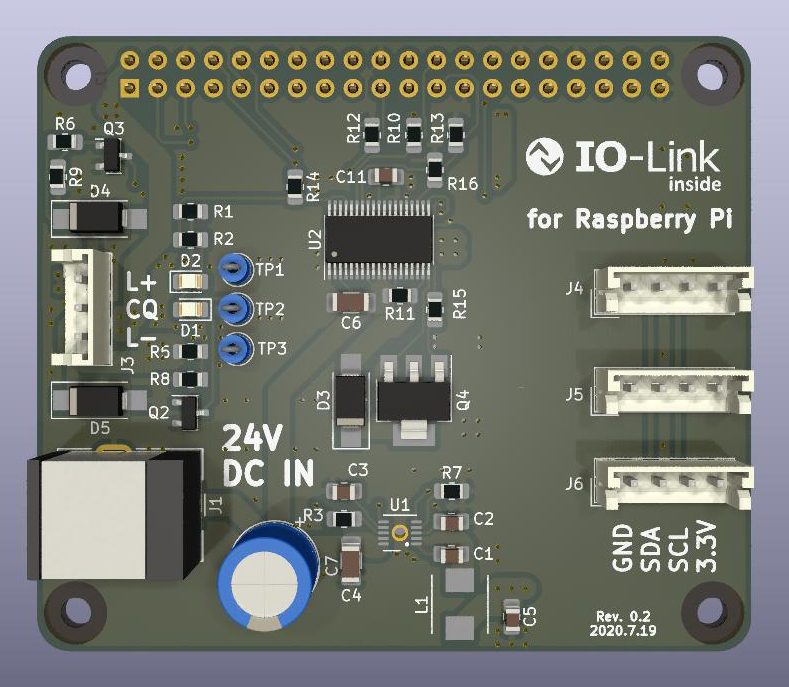

# Raspberry Pi IO-LINK Hat

## 概要

Raspberry Pi と IO-Link 基板を接続するためのブリッジ基板です．

24V 電源で動作し，IO-Link 機器と Raspberry Pi への電源の供給を行います．

## 使用部品

使用している主な部品は以下の通りです．

| リファレンス | Mouser #             |
| ------------ | -------------------- |
| D3           | 512-S100             |
| D4, D5       | 755-PTZTFTE2536B     |
| J1           | 490-PJ-063AH         |
| L1           | 810-SPM5030VT-2R2M-D |
| Q2, Q3       | 757-T2N7002BKLM      |
| Q4           | 512-FQT7N10LTF       |
| U1           | 584-LT8609AJDDM-5#TR |
| U2           | 584-LTC2874IFE#PBF   |
